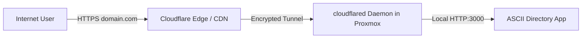

# Exposing ASCII Directory via Cloudflare Domain & Tunnels

This guide explains how to connect your ASCII Directory running in Proxmox to your custom domain on Cloudflare with **zero router port forwarding** and **free automatic SSL**.

---

## Architecture Overview



---

## Method 1: Cloudflare Zero Trust Dashboard (Recommended / Easiest)

1. **Log in** to your [Cloudflare Dashboard](https://dash.cloudflare.com) and select your domain.
2. Go to **Zero Trust** -> **Networks** -> **Tunnels**.
3. Click **Create a Tunnel** and choose **Cloudflared**.
4. Name your tunnel (e.g. `proxmox-directory-tunnel`).
5. Choose your environment in the dashboard (Docker or Debian/Ubuntu for LXC):
   - **For Docker / Docker Compose**: Copy the tunnel token into your `docker-compose.yml` or run:
     ```bash
     docker run -d --restart=unless-stopped cloudflare/cloudflared:latest tunnel --no-autoupdate run --token <YOUR_TOKEN>
     ```
   - **For Proxmox LXC**: Copy the debian/ubuntu command provided in the dashboard, for example:
     ```bash
     curl -L --output cloudflared.deb https://github.com/cloudflare/cloudflared/releases/latest/download/cloudflared-linux-amd64.deb
     dpkg -i cloudflared.deb
     cloudflared service install <YOUR_TOKEN>
     ```
6. In the **Public Hostname** tab in Cloudflare Dashboard:
   - **Subdomain / Domain**: `directory.yourdomain.com` (or root `@`)
   - **Service Type**: `HTTP`
   - **URL**: `localhost:3000` (or `ascii-directory:3000` if in same docker network, or your LXC local IP `192.168.1.X:3000`)
7. Click **Save Hostname**. Your ASCII Directory is now live worldwide over HTTPS!

---

## Method 2: CLI `cloudflared` Configuration (Config File)

If you prefer managing tunnels via CLI:

1. **Install `cloudflared`**:
   ```bash
   curl -fsSL https://pkg.cloudflare.com/cloudflare-main.gpg | sudo tee /etc/apt/trusted.gpg.d/cloudflare.gpg >/dev/null
   echo 'deb [signed-by=/etc/apt/trusted.gpg.d/cloudflare.gpg] https://pkg.cloudflare.com/cloudflared bullseye main' | sudo tee /etc/apt/sources.list.d/cloudflared.list
   sudo apt-get update && sudo apt-get install cloudflared
   ```

2. **Authenticate with your Cloudflare Account**:
   ```bash
   cloudflared tunnel login
   ```

3. **Create Tunnel**:
   ```bash
   cloudflared tunnel create retro-directory
   ```

4. **Create Configuration File** (`~/.cloudflared/config.yml`):
   ```yaml
   tunnel: <TUNNEL-UUID>
   credentials-file: /root/.cloudflared/<TUNNEL-UUID>.json

   ingress:
     - hostname: directory.yourdomain.com
       service: http://localhost:3000
     - service: http_status:404
   ```

5. **Route DNS in Cloudflare**:
   ```bash
   cloudflared tunnel route dns retro-directory directory.yourdomain.com
   ```

6. **Start Tunnel Service**:
   ```bash
   cloudflared service install
   systemctl enable --now cloudflared
   ```
